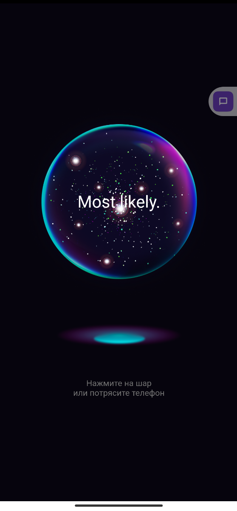

# Целевая платформа

Проверял на реальном андроид девайсе (Readme Note 10 Pro с android 13)

# Результаты

Успел реализовать только 3 задания (задачи 1,2 и 3)
- получилось реализовать отдельный компонент с возмозностью обновления себя же по нажатию на него.
- научился работать с запросами и обрабатывать ответ. 

# Ссылки на демонстрацию работы/скриншоты

Придерживался дизайна так что ничего особенного.

https://github.com/NazarchukLN/flutter-test-app/tree/develop
